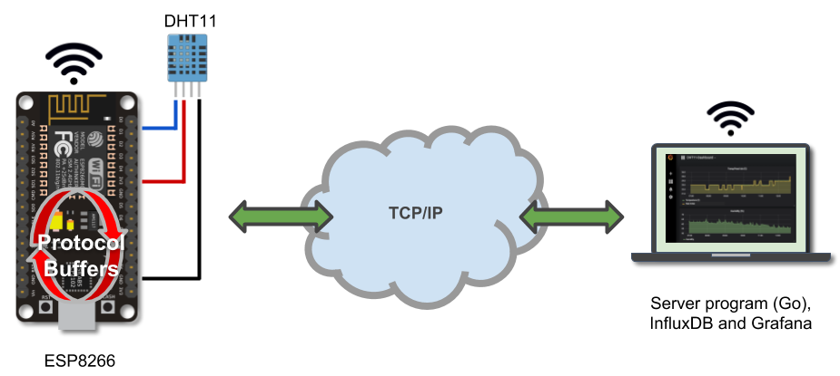

# Measuring Temperature with the ESP8266, Protocol Buffers, InfluxDB, Grafana, Go, and Kubernetes


This repository contains code which makes up an IoT project that measures and visualizes temperature data using an ESP8266, protocol buffers, InfluxDB, Grafana, and Go.  The [ESP8266](https://www.espressif.com/en/products/hardware/esp8266ex/overview) is a small, but capable, microcontroller from Espressif that can be programmed with Arduino C and many other languages that can interoperate with C.  This project uses the microcontroller board to create a temperature logger that:

- reads temperature data from a sensor (DHT11)
- encodes the data using protocol buffers
- sends the data to a backend server (written in Go), which
- saves the data into InfluxDB as time series data
- uses Grafana to visualize the data



# What you will need

To build and run this project you will need the followings:

- ESP8266 (I used the [NodeMCU](https://www.amazon.com/pack-ESP8266-microcontroller-NodeMCU-CP2102/dp/B071NSSQTL))
- ESP8266 Arduino core libraries
- DHT11 (temp/humidity sensor or [similar](https://www.amazon.com/RobotDyn-Temperature-Humidity-projects-Raspberry/dp/B073S3SJXP))
- Adafruit Arduino sensor libraries (for DHT11)
- Arduino IDE (C/C++)
- [Protocol buffers](https://developers.google.com/protocol-buffers/) compiler (protoc)
- Nanopb (C protoc plugin)
- InfluxDB
- Grafana
- The Go programming language (with workspace setup properly)
- Kubernetes (optional)

# Installation and setup

## Install the Arduino IDE

Download and [Install](https://www.arduino.cc/en/Main/Software) the Arduino IDE.  If you prefer to use a different IDE platform, make sure it is supported by the ESP8266 boards.

## Install the ESP8266 Arduino core

Next, you will need to configure Arduino IDE and install the library cores for the ESP8266. 

- Start the Arduino IDE
- Open the `Preferences` window
- In the `Additional board manager URLs` field, enter board manager URL `http://arduino.esp8266.com/stable/package_esp8266com_index.json`.
- Next have Arduino download the ESP8266 core libraries.  Go to menu `Tools` > `Boards:"xxxx"` and select `Board Manager...` 
- Once the Board Manager window opens, scroll or search directly for `esp8266`. If the board manager URL was properly added (earlier), you will see the ESP8266 library listed as a result of the search.
- Next, select `Install` to have Arduino download the core libraries
- Restart Arduino IDE

The previous steps will install libraries for several ESP8266 development boards form many vendors (including NodeMCU).  You can verify that the libraries are installed by going to menu `Tools` > `Board:"xxxx"` and you should see ESP8266 modules listed.

For more detail, see the [ESP8266 GitHub repo](https://github.com/esp8266/Arduino#installing-with-boards-manager). 

Core library documentation for the ESP8266 are [here](https://arduino-esp8266.readthedocs.io/en/latest/).

## Configure Arduino library modules for the DHT11 sensor
In order to use be able to read data from the DHT11, you will need to use an Arduino library module.  There are a few of them available.  This example uses the module from [Adafruit.com](https://www.adafruit.com/).

### 1. Install the Adafruit Unified library module
From the Arduino IDE:

- Select menu `Sketch` > `Include Library` > `Manage Libraries...`
- When the Library Manager window opens, search for module `Adafruit Unified Sensor`
- Click on the module and click `Install`
- Restart the IDE.

### 2. Install the Adafruit DHT11 library module
From the Arduino IDE:
- Select menu `Sketch` > `Include Library` > `Manage Libraries...`
- When the Library Manager window opens, search for module `DHT Sensor Library`
- Click on the module (ensure it is `by Adafruit`) and click `Install`.
- Restart the IDE.


## Install ESP8266 USB-to-UART driver
Most ESP8266 development boards come with a USB-to-UART brige controller that allows serial connectivity to USB using a UART interface.  This is important because you will plug in the development board to your host computer using a USB cable so that it can be programmed using Arduino. 

The bridge controller requires you to install a driver on your host computer for it to work properly.  If you look under your device, it may have the driver name/version printed.  Many of these ESP8266 boards use the CP2102 USB-to-UART bridge driver from [Silicon Labs](https://www.silabs.com/).

* [Download driver here](https://www.silabs.com/products/development-tools/software/usb-to-uart-bridge-vcp-drivers) - select the one for your OS
* Follow instructions to install your driver on your host computer.
* Restart the Arduino IDE (if it was running).
* Using a good quality USB chord (capable of power and data), plug in the ESP8266 board to your computer.
* From menu `Tools` > `Port`, look for the Silicon Labs driver named `/dev/cu.SLAB_USBtoUART`
* Compile and load a demo sketch to test your setup

### Troubleshooting
You may run into issues after installing the driver above. After connecting the device, it may not show up in the port listing in the Arduino IDE.  If that is the case there are couple of things to consider:

1) **IMPORTANT**  - Use a good to high quality micro-USB cable that is capable of providing both data and power.  This will save you hours of troubleshooting.
2) **MacOS (Sierra/High Sierra or later)** - can run into issues where the does not start at all due to OSX extension restrictions. The followings may help:

    - After installing the driver on OSX, go to your `Security and Privacy` settings and allow the "System software from developer Silicon Laboratories Inc" to load by clicking on the `Allow` button.

- If you don't see the `Allow` button (from above step) or your driver is still not showing up in Arduino, continue troubleshooting with the following stes.
```shell
$> kextstat | grep labs
  185    0 0xffffff7f846d2000 0x9000     0x9000     com.silabs.driver.CP210xVCPDriver (5.0.4) AB2A33AD-B60D-35F9-A3F5-084252A66E50 <142 23 4 3>
```
- If the above comomand returns empty, then you will have to start the driver manually using the following:
  
```shell
$> sudo kextload /Library/Extensions/SiLabsUSBDriver.kext/
```
- The previous may fail with security policy errors.  If that is the case, under System Preferences, go into `Security and Privacy`. Look for a request to accept/start/allow driver from Silicon Labs. Click on `Allow` to allow the driver to run.
  - Then validate that the driver is running using the `kextstat` command.  If not, restart it using the `kextload` command (see above).
  - Then as an additional validation step, use the following to make sure the driver is properly running:
```shell
$> sudo kextutil -tn /Library/Extensions/SiLabsUSBDriver.kext
```
  - Lastly, after connecting your ESP8266 device, you can check to make sure the device is recognized as a Silicon Labs device.  Make sure the `/dev/cu.SLAB_USBtoUART` is listed as shown below: 
```shell
$> ls -l /dev/cu.*
crw-rw-rw-  /dev/cu.Bluetooth-Incoming-Port
crw-rw-rw-  /dev/cu.SLAB_USBtoUART
```
 - Next, start the Arduino IDE, open an example sketch, connect the device, and try to load the example unto the device.

## Install the protocol buffers compiler
This project uses protocol buffers to efficiently send temperature data from the ESP8266 to a backend server.  To install the protobuf compiler (protoc), you can install pre-built binaries or build from scratch.

Find out how to get started with the compiler [here](https://github.com/google/protobuf#protocol-compiler-installation).

> **Note** If you use Homebrew on OSX, you can install the protobuf compiler with 
> ```
> brew install protobuf
> ```

## Install and configure Nanopb
The protobuf encoder code generated by the standard protoc plugin are much too large to be loaded unto the ESP8266. Luckily, open source project [Nanopb](https://github.com/nanopb/nanopb) is a protoc plugin that can generate small plain-C code capable of running on restricted devices like the ESP8266.


### 1. Install the *gRPC* tooling for Python
Nanopb relies on the Python protocol buffers tooling. One of the quickest/easiest way to get this is to install the gRPC Python framework. This will automatically fetch needed Python dependencies.  
>Prior to the next command, make sure you install Python pip dependency manager.

```shell
$> pip install grpcio-tools
```

### 2. Clone Nanopb repo
Clone the Nanopb source code form GitHub https://github.com/nanopb/nanopb
into a known location (say `nanopb-src`).  Instead of compiling the Nanopb source to a binary, we will use the protoc Python plugin.

### 3. Compiling proto files using Nanopb
Once you have a protobuf IDL file saved in a known location, you can compile it using the Nanopb protoc plugin.

>Nanopb supports both protobuf version 2 and 3.

While in the directory with the proto files, run the following command to compile the proto IDL into C code:
```shell
$> protoc \
   --plugin=protoc-gen-nanopb=/Users/someuser/nanopb-src/generator/protoc-gen-nanopb \
   --nanopb_out=. *.proto
```
The previous command uses the nanopb protoc plugin by specifying its full path where it was cloned (above).  Make sure to use a fully-qualified path and not a relative path for the plugin location.

## Setup Nanopb library module for Arduino
In order to use Nanopb C encoder/decore library in your Arduino code, you will need to setup an Arduino library which makes it easy to import and re-use in projects.  

* Locate Arduino's project library directory (usually located somewhere like `<user-home>/Documents/Arduino/libraries/`).  
* Create a directoy in there called `Nanopb`
* From the cloned Nanopb repository (from GitHub), copy the following files to the library (`<user-home>/Documents/Arduino/libraries/Nanopb`)
   - `pb.h`
   - `nanopb-src/pb_encode.c, pb_encode.h`
   - `nanopb-src/pb_decode.c, pb_decode.h`
   - `nanopb-src/pb_common.c, pb_common.h`
* Next, open/restart the Arduino IDE

Now, Go to menu `Sketch` > `Include Library` > `Contributed Library`, you should see `Nanopb` listed. This allows the Nanopb to be re-used in any number of Arduino projects.

> See [here]( http://www.arduino.cc/en/Guide/Libraries) for info on Arduino project libraries

## Install and configure InfluxDB
On the server side of the project, InfluxDB is used to store incoming temperature data as time series. You will need to install InfluxDB in your environment.  There are installer packages available for many platforms including OSX and Linux.  For instance, on OSX use:

```shell
$> brew install influxdb
```

Before starting InfluxDB, update the config file, `/usr/local/etc/influxdb.conf`, to enable HTTP and authentication.

```
[http]  
enabled = true  
auth-enabled = true         # will enforce authentication
...
```

Next, start the server manually:

```shell
$> influxd -config /usr/local/etc/influxdb.conf
```
>Find detail instructions on installing and configuring InfluxDB [here](https://docs.influxdata.com/influxdb/latest/introduction/installation/).


Next, start the InfluxDB CLI and create (and verify) the database which will be used to store the sensor data:
```shell
$> influx
Connected to http://localhost:8086 version v1.5.4
InfluxDB shell version: v1.5.4
> CREATE DATABASE dht11
> SHOW DATABASES
name: databases
name
----
_internal
dht11
```

Next, while still in `influx` CLI, create a DB users:

```shell
> CREATE USER admin WITH PASSWORD 'admin' WITH ALL PRIVILEGES
> CREATE USER svcuser WITH PASSWORD 'svcuser'
> GRANT ALL ON dht11 TO svcuser
> exit
```

Lastly, in order to compile the Go server, you will need to install the InfluxDB client library.

```shell
$> go get "github.com/influxdata/influxdb/client/v2"
```

## Install and configure Grafana
Grafana is used to visualize the data stored in InfluxDB. You will need to install Grafana which comes with installer packages for Linux and OSX. For instance, on OSX, use:

```
$> brew install grafana
```

Now, start the Grafana service (manually)
```
$> grafana-server  --homepath /usr/local/Cellar/grafana/<grafana-version>/share/grafana/
```

> Find detail on installation (including other OSs and Docker) and startup options for Grafana [here](http://docs.grafana.org/installation/).

Next, configure an InfluxDB datasource in grafana.

|Field| Value|
|----|--------|
|Name| ESP8266 |
|Type| InfluxDB |
|URL|The InfxuxDB service endpoint, i.e. http://localhost:8086|
|Auth| Select `Basic-Auth`|
|Basic Auth detail| Provide username/password setup in InfuxDB earlier i.e. `svcuser`/`svcuser`|
|InfluxDB Detail|`Database:dht11`, `username:svcuser`, `password:svcuser`|

After entering the datasource information, hit `Save and Test` button to make sure everything works. If everything works, you will see a message `Datasource is working`.

## Install and configure Go protoc plugin
The server, which processes incoming temperature data from the device, is written in Go in this example.  As you will see later, prior to generating Go code for protocol buffers, a Go protoc plugin must be installed as shown:

```shell
$> go get -u github.com/golang/protobuf/protoc-gen-go
```

> You can find further info on the Go protocol buffers packages [here](https://github.com/golang/protobuf).

# Protocol buffers
As mentioned earlier, this project uses [protocol buffers](https://developers.google.com/protocol-buffers/) to encode temperature data from a device-connected sensor to be sent to a remote server.  Protocol buffers is an efficient, universal, language and platform-neutral protocol for serializing binary data.

## The temperature protobuf IDL file
To use protocol buffers for this project, the first step is to define an [interface definition language](https://developers.google.com/protocol-buffers/docs/proto) (IDL) which specifies constructs that represent the messages to be encoded and serialized.  The following is the IDL for the temperature data that will be collected from the device.

```proto
syntax = "proto2";
package pb;

message TempEvent {
    required int32 deviceId = 1;
    required int32 eventId = 2;

    required float humidity = 3;
    required float tempCel = 4;
    required float heatIdxCel = 5;
}
```
File [`temp.proto`](./protobuf/temp.proto)

Message `TempEvent` defines the structure of the data to be encoded as protocol buffers. Protobuf supports several data types including map and arrays.  Learn more about the IDL format [here](https://developers.google.com/protocol-buffers/docs/proto).


# Programming the device
The code that runs on the device is written using Arduino C.  For this project, the code is kept simple for illustrative purposes.  You can extend it however you want.  

## Compile the protobuf IDL to C source code
The first step in programming the device is to compile the IDL into a series of C files which can be integrated into the Arduino source code.  Again, assuming the Nanopb plugin source code is located in directory `nanopb-src/`, the following can be used to compile the IDL file. 

```shell
$> cd protobuf
$> protoc \
   --plugin=protoc-gen-nanopb=/<sompath>/nanopb-src/generator/protoc-gen-nanopb \
   --nanopb_out=. temp.proto
```

The previous command will generate a header and a C source fiels:
```shell
temp.pb.c
temp.pb.h
```

The header file contains the defition of a struct type, `pb_TempEvent` that represents the IDL message from the protofile.

```cpp
typedef struct _pb_TempEvent {
    int32_t deviceId;
    int32_t eventId;
    float humidity;
    float tempCel;
    float heatIdxCel;
} pb_TempEvent;

```

## Create Arduino library module with generated files
Next, in order to import the generated C files into our Arduino project, we need to create an Arduino library module for the generated C files. 
* Inside the Arduino global libraries directory (`<user-home>/Documentes/Arduino/libraries`), create directory `TempEvent/`.
* Copy generated files `temp.pb.h` and `temp.pb.c` to directory `<user-home>/Documents/Arduino/libraries/TempEvent`.

Now, open/restart Arduino IDE. You should see the library module listed in menu `Sketch` > `Include Library` > `Contributed LIbrary`.

## The Arduino sketch file
Now let us explore the Arduino sketch file ([found here](./sketch/esp8266_dht11/esp8266_dht11.ino)).

### Imported libraries
The sketch file integrates three libraries to function properly :
- the ESP8266 WIFI
- the DHT library 
- the Nanopb library
- TempEvent library

These libraries can be imported into the sketch file by going to menu `Sketch` > `Include Library` as shown in the following snippet:

```c
#include <temp.pb.h>

#include <pb_common.h>
#include <pb.h>
#include <pb_encode.h>
#include <pb_decode.h>

#include <DHT.h>
#include <DHT_U.h>

#include <ESP8266WiFi.h>
```

### GPIO/pin mapping
It is important to identify the GPIO pin you will use to receive the temperature reading from the DHT11.  For the NodeMCU ESP-12 ESP8266-based boards, the GPIO and the marked pins on the board are different.  For instance, for the code, GPIO5 is used, but it's indexed at pin 1 on the board.

```c
#define DHTPIN 5    
```

### The ESP8266WIFI and TCP setup
The code will need to intialize WIFI connectivity to an access point and open a TCP socket to an network address. The configuration for WIFI and TCP is provided in the follwoing snippet:

```c
const char* ssid     = "<SSID-Name>";
const char* password = "<WIFI Pwd>";
const char* addr     = "<Server-IP";
const uint16_t port  = 10101;
```

The values above must be updated to match your network configuration.  Ensure the remote server program is running on a TCP address and port that matche the value above.


### The setup() function
The sketch's `setup()` function is used to continuously attempt to initiate connectivity to a WIFI endpoint.

```c 
void setup() {
  Serial.begin(115200);
...
  WiFi.mode(WIFI_STA);
  WiFi.begin(ssid, password);

  while (WiFi.status() != WL_CONNECTED) {
    Serial.println("WIFI connection failed, reconnecting...");
    delay(500);
  }

  dht.begin();
}
```

### The loop() function
Once WIFI is setup, the code then starts to immediately read the temperature from the DHT sensor in the `loop()` function.  A variable of type `pb_TempEvent` is used to store the temperature and humidity values.

```c
void loop() {
...
  if (!client.connect(addr, port)) {
    Serial.println("connection failed");
    delay(5000);
    return;
  }
  
  float hum = dht.readHumidity();
  float tmp = dht.readTemperature();
  float hiCel = dht.computeHeatIndex(tmp, hum, false);
    
  pb_TempEvent temp = pb_TempEvent_init_zero;
  temp.deviceId = 12;
  temp.eventId = 100;
  temp.humidity = hum;
  temp.tempCel = tmp;
  temp.heatIdxCel = hiCel;
  
  sendTemp(temp);
}
```
### Sending data to server
The temperature data is then encoded and serialized over TCP to the backend server in function `sendTemp()`:

```c
void sendTemp(pb_TempEvent e) {
  uint8_t buffer[128];
  pb_ostream_t stream = pb_ostream_from_buffer(buffer, sizeof(buffer));
  
  if (!pb_encode(&stream, pb_TempEvent_fields, &e)){
    Serial.println("failed to encode temp proto");
    return;
  }
  client.write(buffer, stream.bytes_written);
}

```

## Wiring the DHT11
This project used a breakout shield version of the DHT11 for easy wiring with a project board.  The DHT11 shield exposes a ground, data, and Vcc wire all of which can be driven by the pins on the NanoMCU ESP8266 board.  For this project, the data wire is connected in GPIO5 on the ESP8266 board and Vcc is connected to the 3v source.

> You can see a GPIO mapping of the NodeMCU [here](http://www.electronicwings.com/nodemcu/nodemcu-gpio-with-arduino-ide).


# Programming the service
The code that processes the data from the device is written in Go.  It is a simple TCP socket service that listens for incoming protocol buffers encoded data on a given port.  The server decodes the binary data into a Go type generated from the protobuf IDL.

## Compile protobuf IDL for Go
The following generates the Go code that will be used by the server program to decode incoming protocol buffer encoded temperature data.

```shell
$> protoc --go_out=. temp.proto
```

The previous command uses the Go protoc plugin to generate file `temp.pb.go` which declares type `TempEvent` to represent decoded temperature data:

```go
type TempEvent struct {
	DeviceId         *int32   `protobuf:"varint,1,req,name=deviceId" json:"deviceId,omitempty"`
	EventId          *int32   `protobuf:"varint,2,req,name=eventId" json:"eventId,omitempty"`
	Humidity         *float32 `protobuf:"fixed32,3,req,name=humidity" json:"humidity,omitempty"`
	TempCel          *float32 `protobuf:"fixed32,4,req,name=tempCel" json:"tempCel,omitempty"`
	HeatIdxCel       *float32 `protobuf:"fixed32,5,req,name=heatIdxCel" json:"heatIdxCel,omitempty"`
}

```

## The server code

>You can see the full Go server code [here](./server/tempsvr.go).

The code for the server creates a TCP socket at a designated port to listen for incoming connections from the device.  Notice we need to import the protocol buffers and the InfluxDB libraries:

```go
import (
...
	temp "./pb"
	"github.com/golang/protobuf/proto"
	influx "github.com/influxdata/influxdb/client/v2"
)

func main(){
...
    ln, err := net.Listen(network, addr)
    if err != nil {
        log.Println(err)
        os.Exit(1)
	}...
    
    for {
        conn, err := ln.Accept()...
        go handleConnection(conn)
    }
}
```

When a connection is established, it reads the data from the device and decode it into a value of type `TempEvent`:

```go
fun handleConnection(conn net.Conn) {
...
    buf := make([]byte, 1024)
    n, err := conn.Read(buf)...
    
    var e temp.TempEvent
    if err := proto.Unmarshal(buf[:n], &e); err != nil {
		return
    }
    
    postEvent(e)
}
```

Lastly, after the temperature data is decoded, it is sent to an instance of InfluxDB to be saved as time series entries.

```go
func postEvent(e temp.TempEvent) error {
	if db != nil {

		bp, err := influx.NewBatchPoints(influx.BatchPointsConfig{
			Database:  "dht11",
			Precision: "s",
		})...

		tags := map[string]string{
			"deviceId": fmt.Sprintf("%d", e.GetDeviceId()),
			"eventId":  fmt.Sprintf("%d", e.GetDeviceId()),
		}

		fields := map[string]interface{}{
			"temp":      e.GetTempCel(),
			"humidity":  e.GetHumidity(),
			"heatIndex": e.GetHeatIdxCel(),
		}

		pt, err := influx.NewPoint("sensor-temp", tags, fields, time.Now())
		bp.AddPoint(pt)
		if err := db.Write(bp); err != nil {
			return err
		}
	}
	return nil
}
```

## Running the code
Because this is a simple example to illustrate how all the parts work together, you can simply start the server with go run command:

```shell
$> go run ./server/tempsvr.go
2018/06/28 15:44:33 Temperator Service started: (tcp) :10101
```
If the device is running and is capable of reaching the server on the provided address and port, you will immediately see a connection come through with temperature data:

```shell
2018/07/29 11:01:53 Connected to  172.17.0.1:49839
{DeviceID:12, EventID:100, Temp: 25.00, Humidity:58.00%, HeatIndex:25.07}
2018/07/29 11:01:53 posting temp event to influxDB
2018/07/29 11:01:53 INFO: closing connection
```

## Running the server code in Docker 
If you don't want to download Go and build the service, you can run the server using Docker.  You can build the provided [Dockerfile](./server/Dockerfile), which builds a statically-linked binary to avoid any runtime dependency errors. Or you can pull a pre-built Docker image:

```shell
$> docker pull quay.io/vladimirvivien/esp8266-tempsvr
```

By default, the server exposes listening port `101001` and can be started with:

```shell
$> docker run -p 10101:10101 quay.io/vladimirvivien/esp8266-tempsvr
```

# Deploying on Kubernetes (optional)
If you are reading this, you are most likely comfortable (or curious about) using Kubernetes.  This section walks you through deploying the backend service components on a Kubernetes cluster. 

For this example, let us assume:
 - You have a running local Kubernetes on [`minikube`](https://kubernetes.io/docs/setup/minikube/) 
 - Or, if you have Kubernetes running in a cloud service or on bare metall setup, that will work too.  
 - [`Helm`](https://docs.helm.sh/) will be used to deploy InfluxDB and Grafana. 

## Deploy InfluxDB with Helm

Next, use helm to deploy and configure an InfluxDB database. Notice the use of [enviroment variables](https://hub.docker.com/_/influxdb/) to configure the database.  

 ```shell
$> helm install --name dht11-db \
    --set config.http.auth-enabled=true \
    --set config.admin.enabled=true \
    --set env[0].name=INFLUXDB_DB,env[0].value=dht11 \
    --set env[1].name=INFLUXDB_ADMIN_USER,env[1].value=admin \
    --set env[2].name=INFLUXDB_ADMIN_PASSWORD,env[2].value=admin \
    --set env[3].name=INFLUXDB_USER,env[3].value=svcuser \
    --set env[4].name=INFLUXDB_USER_PASSWORD,env[4].value=svcuser \
stable/influxdb
```
This will display a series of output on the installed chart:

```shell
NAME:   dht11-db
LAST DEPLOYED: Thu Jul 26 18:42:45 2018
NAMESPACE: default
STATUS: DEPLOYED
.
.
.
NOTES:
InfluxDB can be accessed via port 8086 on the following DNS name from within your cluster:

- http://dht11-db-influxdb.default:8086
```
Make note of the service DNS name (above) and port for the application (i.e. `dht11-db-influxdb.default:8086`). 

### Verfication
You can validate the DNS address by doing an `nslookup` command:

```shell
$> kubectl run -it --rm alpine --image=alpine:3.6 --restart=Never nslookup dht11-db-influxdb.default

Name:      dht11-db-influxdb.default
Address 1: 10.96.29.163 dht11-db-influxdb.default.svc.cluster.local
```

You can also use the `influx` CLI to ensure that the database is setup properly:

```shell
$> kubectl run -it --rm influxdb --image=influxdb:1.5-alpine --restart=Never --command bash
bash-4.3# influx -host dht11-db-influxdb.default
Connected to http://dht11-db-influxdb.default:8086 version 1.4.3
InfluxDB shell version: 1.5.4
> SHOW DATABASES
name: databases
name
----
dht11
_internal
```

## Deploy Grafana with Helm
Next, use Helm again to deploy the Grafana application:
```shell
$> helm install --name dht11-dashboard \
   --set adminUser=admin,adminPassword=admin \
stable/grafana
```

### Log into Grafana portal
Next, use `kubectl get pods` to get the name of the Grafana pod deployed.  Then, from a node (capable to be reached from outside the cluster) on the cluster, use command `kubectl port-forward` to proxy traffic to a port on the pod as follows ( don't forget to set `POD_NAME` to your actual pod name):

```shell
$> export POD_NAME=`dht11-dashboard-grafana-79ddb8d7db-kqwh9`
$> kubectl --namespace default port-forward $POD_NAME  3000
```
From a web browser, log unto Grafana at proxied address using the admin username/password from above.  Then configure an InfluxDB datasource:

|Field| Value|
|----|--------|
|Name| ESP8266 |
|Type| InfluxDB |
|URL|The InfxuxDB service endpoint (i.e. http://dht11-db-influxdb.default:8086, the service address from earlier)|
|Auth| Select `Basic-Auth`|
|Basic Auth detail| Provide username/password setup in InfuxDB earlier i.e. `svcuser`/`svcuser`|
|InfluxDB Detail|`Database:dht11`, `username:svcuser`, `password:svcuser`|

## Deploy Go server 
Now we are going to deploy the Go server Docker image (see above) in a pre-existing Kubernetes cluster so that it can be accessed by the device.

### Create pod deployment
The following uses the `kubectl run` command to create a deployment for `esp8266-tempsvr` image:

```shell
kubectl run esp8266-tempsvr --port=10101 --image=quay.io/vladimirvivien/esp8266-tempsvr -- ./temp-server -r http://dht11-db-influxdb.default:8086 -u svcuser -p svcuser
```

Next, let us inspect the deployment to ensure the created pod is running OK:

```shell
kubectl get deployment/esp8266-tempsvr -o wide
NAME              DESIRED   CURRENT   UP-TO-DATE   AVAILABLE   AGE       CONTAINERS        IMAGES                                   SELECTOR
esp8266-tempsvr   1         1         1            1           15h       esp8266-tempsvr   quay.io/vladimirvivien/esp8266-tempsvr   run=esp8266-tempsvr
```
Notice the `run` command automcatically assigned a selector label for the pod of `run=esp8266-tempsvr`.

## Create a service for external access
Next, we will create a Kubernetes service that will allow us to access the running pod on port 10101, from the outside world, using the `kubectl expose` command: 

```shell
kubectl expose deployment/esp8266-tempsvr --type="NodePort" --port=10101 --target-port=10101
```

> For this example (running on minikube) we will use a service type of `NodePort`. However, that value maybe set differently (LoadBalance, etc) if you are running on cloud or bare metal. 


Now, let's inspect the created service to ensure that it is running and is linked to the deployment with matching label values:

```shell
$> kubectl describe services/esp8266-tempsvr
Name:                     esp8266-tempsvr
Namespace:                default
Labels:                   run=esp8266-tempsvr
Annotations:              <none>
Selector:                 run=esp8266-tempsvr
Type:                     NodePort
IP:                       10.108.104.51
Port:                     <unset>  10101/TCP
TargetPort:               10101/TCP
NodePort:                 <unset>  31678/TCP
Endpoints:                172.17.0.11:10101
Session Affinity:         None
External Traffic Policy:  Cluster
Events:                   <none>
```

## Accessing the service
Access the service will depend on where you have your Kubernetes cluster running.

### Local cluster using minikube
If you are using minikube, you will need to setup a network port-forward rule or a network bridge, in your minikube provider settings, that will forward traffic from the host machine to the minikue guess VM.  

For simplicity, this example was tested this using a NAT port-forwar rules where all host traffic to port `10101` is forwared to the minikube VM on port value `31878` (see `TargetPort` in service` above).  This allowed me to keep my local settings on the ESP8266 device unchanged.

#### Verify minikue cluster access
You can veiry that traffic is getting to the Go temperature server pod by printing log out put from the pod:

```shell
$> kubectl logs pod/esp8266-tempsvr-74846d6b8c-d8kf4

2018/07/29 11:03:01 Connected to  172.17.0.1:49852
{DeviceID:12, EventID:100, Temp: 25.00, Humidity:58.00%, HeatIndex:25.07}
2018/07/29 11:03:02 posting temp event to influxDB
2018/07/29 11:03:02 INFO: closing connection
```

### Cloud services
See your cloud provider documentation on how to setup network rules to expose compute nodes for outside access.